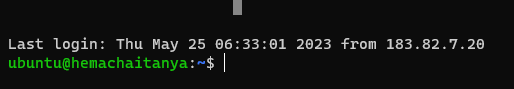

### change the host name 

* first we connect ec2 instance and

* sudo vi /etc/cloud/cloud.cfg

    preserve_hostname: true

* sudo hostnamectl set-hostname <hemachaitanya>.localdomain

*  HOSTNAME=webserver.mydomain.com

* sudo reboot

*  relogin to the machine 

*  Re-change the system hostname without a public DNS name
 * hostname 
